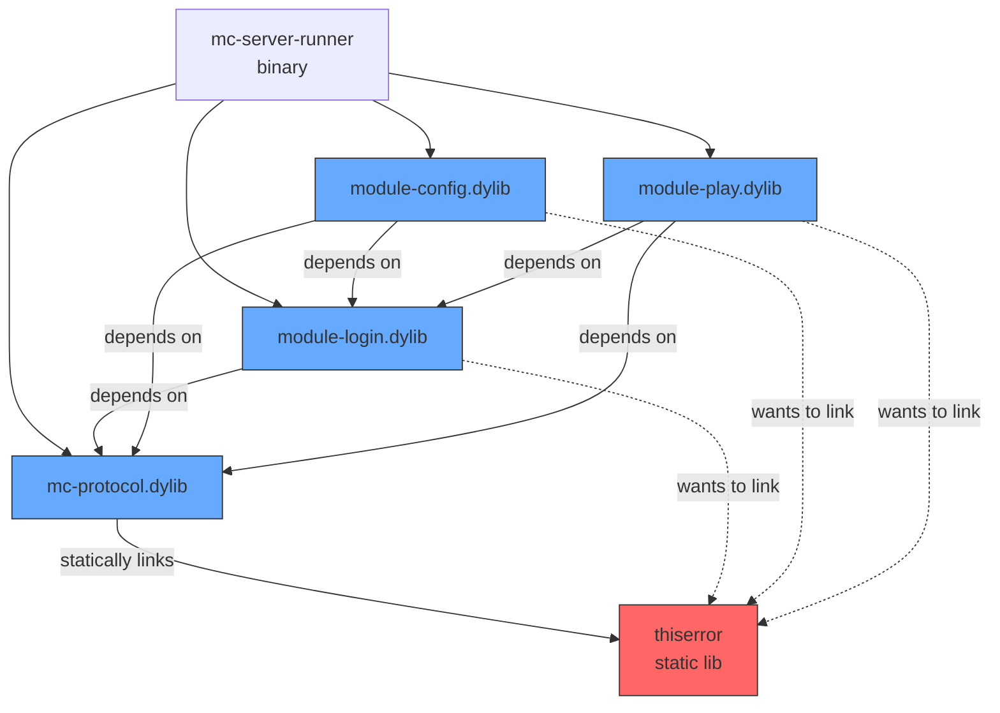

# Known Problems

## Diamond Dependency Problem with Rust Dylibs

### The Issue

Rust's dynamic linking has a fundamental limitation: when multiple dylibs share a common static dependency, the linker cannot safely resolve which copy to use.



### Why This Happens

1. `mc-protocol.dylib` statically links `thiserror` (and `serde`, `eyre`, etc.) internally
2. `module-login.dylib` depends on `mc-protocol.dylib` AND also needs `thiserror`
3. When building `module-login.dylib`, the linker cannot:
   - **Use thiserror from mc-protocol.dylib** — it's private/internal to that dylib
   - **Statically link its own copy** — would create duplicate symbols in the process

Rust refuses to compile because having two copies of the same crate in one process causes undefined behavior (different TypeIds, different statics, different vtables).

### Error Message

```
error: cannot satisfy dependencies so `thiserror` only shows up once
```

### Affected Crates

Any dylib that depends on another dylib AND shares transitive dependencies:
- `module-login` → depends on `mc-protocol`
- `module-config` → depends on `mc-protocol` + `module-login`
- `module-chunk` → depends on `mc-protocol`
- `module-play` → depends on `mc-protocol` + `module-login` + `module-chunk`

### Potential Solutions

1. **Flat plugin architecture** — Plugins depend ONLY on the host binary, never on each other or on shared dylibs
2. **Make shared deps rlibs** — Don't make `mc-protocol` a dylib; statically link it into each module
3. **Single "mega dylib"** — One dylib contains all shared code (like Bevy's `dynamic` feature)
4. **Use `-C prefer-dynamic`** — Only works if upstream crates (thiserror, serde) specify `dylib` crate-type (they don't)
5. **Alternative runtime** — Use WASM or scripting (Lua/Rhai) for plugins instead of native dylibs

### References

- [Cargo Issue #3573: How should dynamic linking work in Rust?](https://github.com/rust-lang/cargo/issues/3573)
- [Speeding up incremental Rust compilation with dylibs](https://robert.kra.hn/posts/2022-09-09-speeding-up-incremental-rust-compilation-with-dylibs/)
- [Diamond dependency with dylibs - Rust Forum](https://users.rust-lang.org/t/diamond-dependency-with-dylibs/84382)
