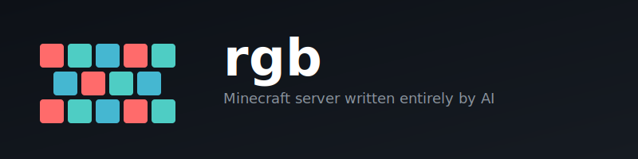

<p align="center">
  
</p>

<p align="center">
  <code>nix run github:andrewgazelka/rgb</code>
</p>

A Minecraft server written entirely by AI (Claude Opus 4.5).

**The experiment:** How far can AI-driven development go? This codebase is 100% AI-authored—no human code. We're pushing the boundaries of what's possible when an LLM has full control.

## The Approach

**AI needs autonomous testing.** Both client and server are in Rust so Opus can spin them up, run tests, and iterate without human intervention. Just `cargo test`—no manual Java clients, no clicking through menus.

**Flat code, not abstractions.** LLMs don't need abstraction layers to manage complexity—they hold full context and reason about details directly. We keep code explicit so the AI can see exactly what every line does.

## Why It Works

- Minecraft removed obfuscation in snapshot **25w46a**—we can read the official source and match it directly in Rust
- Self-contained: client + server + protocol, all Rust, all testable
- Targets latest snapshots to stay ahead

## Status

Early development. Targeting Minecraft snapshot builds.

```
cargo test        # run tests
./ci.sh           # fmt, clippy, tests
```
