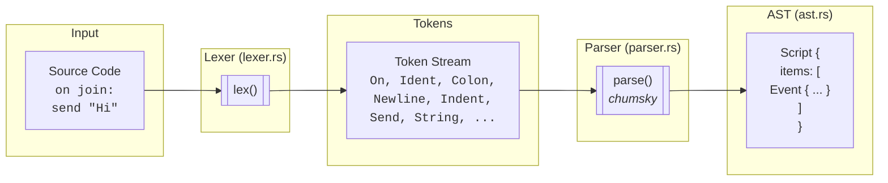
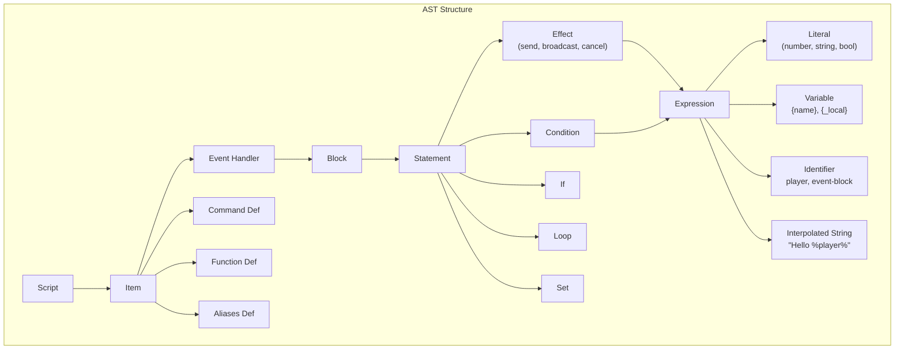

# skript-lang

A parser for the [Skript](https://github.com/SkriptLang/Skript) scripting language used in Minecraft servers.

## Pipeline



## Architecture



## Usage

```rust
use skript_lang::{parse, Script, Item, EventHandler, Block, Stmt, Effect, EffectKind, Expr, Literal, LiteralKind};

let source = "on join:\n\tsend \"Hello!\" to player\n";
let script = parse(source).unwrap();

// Script { items: [Event { event: "join", body: Block { stmts: [...] } }] }
assert_eq!(script.items.len(), 1);

let Item::Event(EventHandler { event, body, .. }) = &script.items[0] else { panic!() };
assert_eq!(*event, "join");

let Stmt::Effect(Effect { kind: EffectKind::Send { message, target }, .. }) = &body.stmts[0] else { panic!() };
let Expr::Literal(Literal { kind: LiteralKind::String(msg), .. }) = message.as_ref() else { panic!() };
assert_eq!(*msg, "Hello!");

let Some(target) = target else { panic!() };
let Expr::Ident(ident, _) = target.as_ref() else { panic!() };
assert_eq!(*ident, "player");
```

## Features

- **Indentation-based syntax** - Python-like block structure via `INDENT`/`DEDENT` tokens
- **Hand-written lexer** - Full control over whitespace and indentation handling
- **Chumsky parser** - Combinator-based parsing with good error messages
- **Zero-copy parsing** - AST references source strings directly (`&'src str`)

## Supported Syntax

| Construct | Example |
|-----------|---------|
| Events | `on join:`, `on break:` |
| Effects | `send "msg" to player`, `broadcast "msg"`, `cancel event` |
| Variables | `{global}`, `{_local}` |
| Set | `set {_x} to 5` |
| Interpolation | `"Hello %player%!"` |
| Literals | `42`, `3.14`, `"string"`, `true`, `false` |
| Comments | `# this is a comment` |
